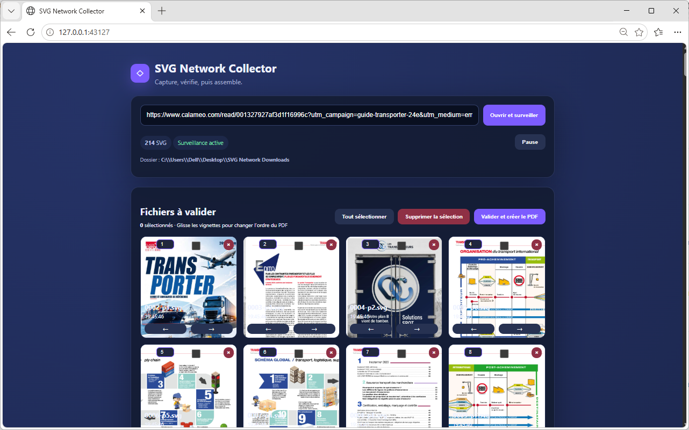

# SVG Network Collector — Web vers PDF

Application de bureau qui capture les pages SVG chargées par les lecteurs web et les assemble en un PDF propre et ordonné.

Elle peut notamment aider à reconstituer un document PDF depuis certaines publications en ligne de type **Calaméo**, catalogues, brochures ou liseuses web qui chargent leurs pages au format SVG.

> Utilisez l’application uniquement pour des publications que vous avez le droit de télécharger, d’archiver ou de convertir.



## Du lecteur web au PDF

Collez l’adresse de la publication, naviguez dans le lecteur pour charger ses pages, puis prévisualisez, triez et validez les pages capturées. L’application crée ensuite un PDF A4 multipage dans l’ordre choisi.

## Fonctionnalités

- capture des pages SVG/SVGZ chargées par les lecteurs web ;
- prise en charge de certaines publications de type Calaméo et d’autres catalogues web ;
- enregistrement automatique dans `Bureau/SVG Network Downloads` ;
- galerie de prévisualisation ;
- sélection et suppression des fichiers ;
- réorganisation des pages par glisser-déposer, boutons ou numéro de page ;
- export des SVG validés dans un PDF A4 multipage ;
- compatibilité Windows et Linux.

## Windows

Sur l’ordinateur où l’application a été créée, lancez directement :

```text
Lancer SVG Collector.cmd
```

Sur un autre ordinateur Windows :

1. Installez Node.js 18 ou plus récent.
2. Lancez `Installer Windows.cmd` une fois.
3. Lancez `Lancer SVG Collector.cmd`.

Microsoft Edge est utilisé en priorité, puis Chrome ou Chromium.

## Linux

Node.js 18 ou plus récent et npm sont requis.

```bash
bash "Installer Linux.sh"
bash "Lancer SVG Collector.sh"
```

Si Chromium signale des bibliothèques système manquantes :

```bash
sudo npx playwright install-deps chromium
```

Le dossier Bureau est détecté avec la configuration XDG, y compris lorsqu’il porte un nom localisé comme `Bureau`.

## Utilisation

1. Lancez l’application.
2. Saisissez l’adresse d’un site dans le tableau de bord.
3. Naviguez dans l’onglet ouvert.
4. Prévisualisez et sélectionnez les SVG capturés.
5. Ajustez leur ordre si nécessaire.
6. Cliquez sur **Valider et créer le PDF**.

Le PDF et les SVG sont enregistrés dans `SVG Network Downloads` sur le Bureau.

## Technologie

- Node.js
- Playwright
- Chromium, Chrome ou Microsoft Edge

## Confidentialité

Le trafic est traité localement sur l’ordinateur. L’application ne transmet pas les SVG capturés à un serveur tiers.
